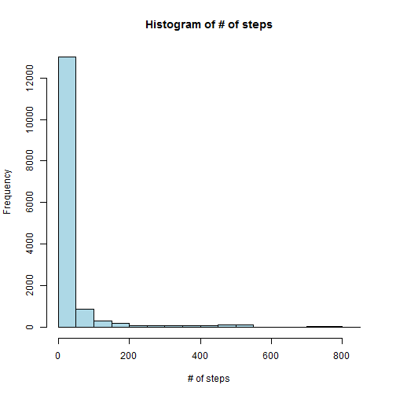
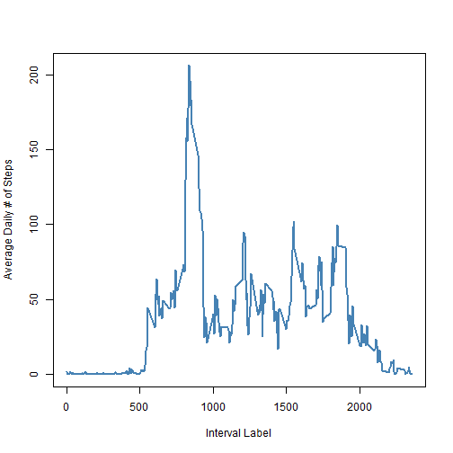
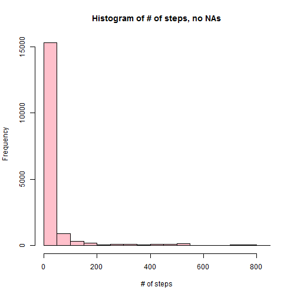
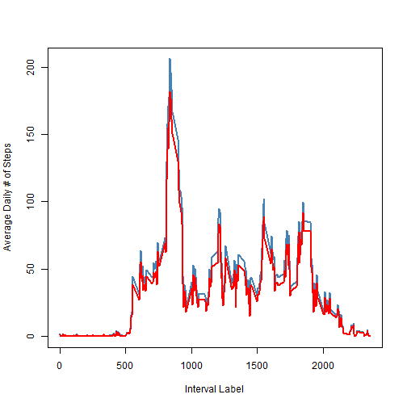
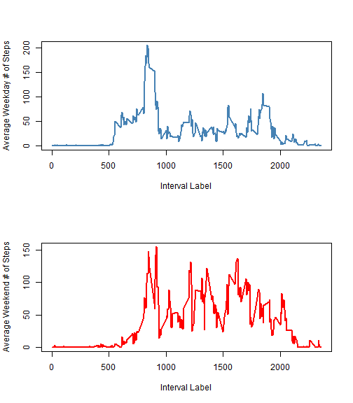

Analysis documentation/code for Reproducible Research Peer Review 1 assignment.  This code aims to answer questions about "quantified self" type activity data from a personal activity monitoring device.  The data is in the format of a .csv file and contains the variables date, # of steps, and interval identifier. The data was taken in five minute intervals from Oct. and Nov. 2012 and missing values are coded as "NA".  

###Loading/pre-processing data.  

We start by downloading the data file to our working directory, unzip it, then read it in. We also go ahead and transform the date column to a "date" object from a factor.    


```r
library(RCurl)
```

```
## Loading required package: bitops
```

```r
download.file('http://d396qusza40orc.cloudfront.net/repdata%2Fdata%2Factivity.zip','activity.zip') 
unzip('activity.zip')
data <- read.csv('activity.csv')
data$date <- as.Date(data$date)
```

###What is mean total number of steps taken per day?  

First we make a histogram to look at the mean number of steps taken in a day. Note that the 'hist' and 'summary' functions ignore missing values.


```r
hist(data$steps, col = 'lightblue', xlab = '# of steps', main = 'Histogram of # of steps')
```

 

Now we make a summary of the steps taken data, which calculates the mean and median number of steps per day.  


```r
summary(data$steps)
```

```
##    Min. 1st Qu.  Median    Mean 3rd Qu.    Max.    NA's 
##     0.0     0.0     0.0    37.4    12.0   806.0    2304
```


###What is the average daily activity pattern?  

Here we break down the the day into five minute windows and average the number of steps across all days, in an attempt to elucidate at what time of day the subject is most active.  

We want to construct a time series of the average number of steps at each of the five minute intervals in the day. There are 61 unique dates, each with 288 intervals of 5 minutes apiece (5*288 = 1440, the number of minutes in a day).  


```r
length(unique(data$date))
```

```
## [1] 61
```

```r
length(unique(data$interval))
```

```
## [1] 288
```

Here we plot a time series of the averages by interval number, ignoring NA values. The abcissa corresponds to the time of day, in 5 minute increments. The labels are given as follows: 0 corresponds to midnight (00:00), 5 to five past midnight (00:05), and so on until the change of hour, in which case we go from 55 to 100, where 100 corresponds to 1 a.m. (01:00), 105 to five past one (01:05), and so on, up until the change from 155 to 200 (2 a.m.), etc.  The last interval is 2355, which corresponds to 11:55 p.m. (23:55).


```r
avgDailySteps <- tapply(data$steps[complete.cases(data$steps)], data$interval[complete.cases(data$steps)], mean)
plot(unique(data$interval), avgDailySteps, col = 'steelblue', xlab = 'Interval Label', type = 'l', lwd = '2', ylab = 'Average Daily # of Steps')
```

 

The time of day with the highest mean number of steps is at interval 835, i.e. 8:35 in the morning. The average number of steps at that time is just over 206.  


```r
unique(data$interval)[avgDailySteps == max(avgDailySteps)]
```

```
## [1] 835
```

```r
max(avgDailySteps)
```

```
## [1] 206.2
```


###Imputing missing values

In our analysis so far we have been ignoring missing values, but this may introduce bias into our analysis if there is a systematic pattern underlying the missing value (non)measurements.  First we report the number of missing values in the data to be 2304, or about 13% of the data.  


```r
length(data$steps[is.na(data$steps)])
```

```
## [1] 2304
```

```r
length(data$steps[is.na(data$steps)])/length(data$steps)
```

```
## [1] 0.1311
```

Next, to estimate the impact of these missing values, we copy the data set and replace the missing values with the median value for that time interval in the day.  


```r
data_NA_replace <- data
medDailySteps <- tapply(data_NA_replace$steps[complete.cases(data_NA_replace$steps)], data_NA_replace$interval[complete.cases(data_NA_replace$steps)], median)

#  lookup table of interval labels
idList <- cbind(1:288,unique(data_NA_replace$interval))

#  replace NA values
for (i in 1:length(data_NA_replace$steps)){
        if (is.na(data_NA_replace$steps[i]) == 1){
                id <- idList[data_NA_replace$interval[i] == idList[,2]]
                data_NA_replace$steps[i] <- medDailySteps[id[1]]
                }
}
```
And we check to make sure that we indeed have no missing values in our data now.  


```r
length(data_NA_replace$steps[is.na(data_NA_replace$steps)])
```

```
## [1] 0
```

Next we plot a histogram of the steps taken per day with imputed missing values...  


```r
hist(data_NA_replace$steps, col = 'pink', xlab = '# of steps', main = 'Histogram of # of steps, no NAs')
```

 

...as well as a summary of the steps taken data, which calculates the mean and median number of steps per day.  


```r
summary(data_NA_replace$steps)
```

```
##    Min. 1st Qu.  Median    Mean 3rd Qu.    Max. 
##       0       0       0      33       8     806
```

Comparing this to summary of the unmodified dataset again...  


```r
summary(data$steps)
```

```
##    Min. 1st Qu.  Median    Mean 3rd Qu.    Max.    NA's 
##     0.0     0.0     0.0    37.4    12.0   806.0    2304
```
...we see that it shifts the mean to a slightly lower value.  If we rerun the average daily steps analysis on the missing-value-replaced dataset and overlay the two plots, we see that replacing the NAs scales the curve down slightly but doesn't shift it in time.  


```r
avgDailySteps_NA_replace <- tapply(data_NA_replace$steps, data_NA_replace$interval, mean)
plot(unique(data_NA_replace$interval), avgDailySteps, col = 'steelblue', type = 'l', lwd = '2', xlab = 'Interval Label', ylab = 'Average Daily # of Steps')
points(unique(data_NA_replace$interval), avgDailySteps_NA_replace, col = 'red', type = 'l', lwd = '2')
```

 

We then confirm this by looking at the maximum number of steps interval and when it occurs in the NA-replaced dataset, seeing that the maximum number of steps decreases to about 182 but that the maximum still occurs at 8:35 in the morning.  


```r
unique(data_NA_replace$interval)[avgDailySteps_NA_replace == max(avgDailySteps_NA_replace)]
```

```
## [1] 835
```

```r
max(avgDailySteps_NA_replace)
```

```
## [1] 181.6
```

###Are there differences in activity patterns between weekdays and weekends?  

To determine whether or not there are differences in the daily activity patterns on weekends/weekdays, we first append a weekday/weekend label to the missing-value-replaced dataset.  


```r
temp <- weekdays(data_NA_replace$date)
temp[temp %in% c('Monday','Tuesday','Wednesday','Thursday','Friday')] <- 'weekday'
temp[temp %in% c('Saturday','Sunday')] <- 'weekend'
temp <- as.factor(temp)
data_NA_replace$day_type <- temp
```

Then we subset out the weekdays versus weekends, average over the daily activity, and plot the resulting time series in separate panels.  


```r
weekSteps <- subset(data_NA_replace, data_NA_replace$day_type %in% 'weekday')
weekendSteps <- subset(data_NA_replace, data_NA_replace$day_type %in% 'weekend')
avgWeekSteps<- tapply(weekSteps$steps, weekSteps$interval, mean)
avgWeekendSteps<- tapply(weekendSteps$steps, weekendSteps$interval, mean)
par(mfcol = c(2,1))
plot(unique(weekSteps$interval), avgWeekSteps, col = 'steelblue', type = 'l', lwd = 2, xlab = 'Interval Label', ylab = 'Average Weekday # of Steps')
plot(unique(weekendSteps$interval), avgWeekendSteps, col = 'red', type = 'l',  lwd = 2, xlab = 'Interval Label', ylab = 'Average Weekend # of Steps')
```

 

Indeed there does seem to be a difference in the weekday vs. weekend activity. In the former, there is a rise around 5 a.m., then a large peak between 8 and 10 a.m., then activity subsides, with some residual peaks throughout the day until 8 p.m., at which time activity falls off again.  

On the weekends activity starts later, rises more slowly at first, then rises sharply to peak at around the same time as on the weekdays.  Activity afterwards has higher amplitude peaks througout the day, and trails of later, around 9 p.m.  

These two activtity time series are possibly due to workday patterns on the weekdays, where the subject rises early, hurries to work, then stays there most of the day, and the weekend, where the subject rises later, goes to a variety of different places in his/her free time, then goes to bed later.  
